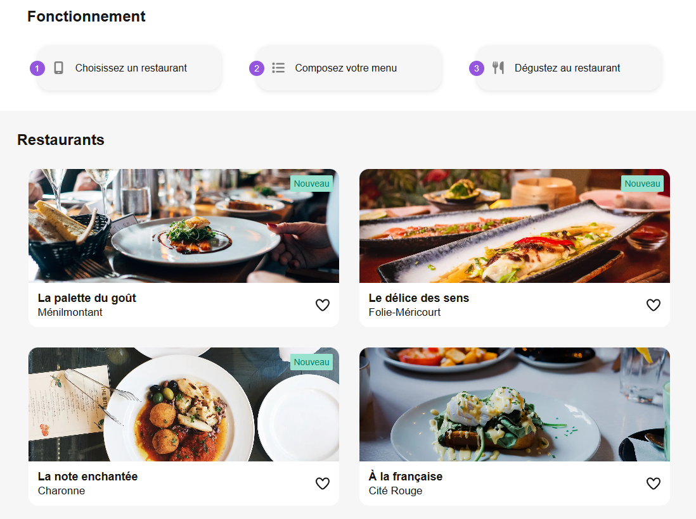
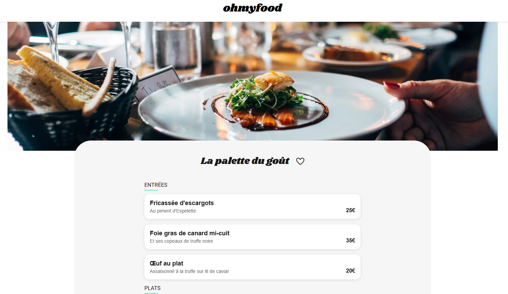

# Projet 5 OC – Exercice Ohmyfood / Project 5 OC - OhmyFood exercise

[](#)
[](#)
[](#)


## Preview

### Homepage



### Menu



---

## 🇫🇷 Version française

Ceci est le dépôt GitHub d’un projet réalisé dans le cadre de ma formation **Développeur IA** avec OpenClassrooms.

L’objectif principal est de développer **"Ohmyfood"**, un site web "mobile-first" qui répertorie les menus de restaurants. 

L'application est développée avec **Next.js** et se concentre sur les points suivants :

1.  **Développement Mobile-First :** Concevoir des interfaces qui s'adaptent élégamment du mobile au desktop.
2.  **Animations CSS :** Intégrer des animations fluides pour les interactions utilisateur, comme les survols de boutons, l'apparition des plats.
3.  **Structure Multi-pages :** Créer une page d'accueil listant les restaurants et des pages de menu individuelles pour chaque restaurant.

### Fonctionnalités Clés

-   Page d'accueil avec la liste des restaurants.
-   Pages de menu détaillées pour chaque restaurant.
-   Animation de "cœur" pour la mise en favoris.

## Technologies utilisées

| Pile Technique| Outil | Rôle |
| :--------------------- | :-------------- | :-------------- |
| **Framework**          | **Next.js**     | Framework React pour le développement d'applications web modernes.   |
| **Bibliothèque UI**    | **React**   | Bibliothèque pour la construction de l'interface utilisateur.        |
| **Style & Animations** | **CSS Modules / SASS**   | Pour le style des composants et la création d'animations complexes.  |
| **Icônes**             | **Font Awesome**    | Bibliothèque d'icônes pour l'interface utilisateur.                  |

## Installation & utilisation

Pour lancer le projet en local, suivez ces étapes :

1.  **Cloner le dépôt**

    ```bash
    git clone https://github.com/ifTrueReturnFalse/retraining-react-next-ohmyfood.git
    cd retraining-react-next-ohmyfood
    ```

2.  **Installer les dépendances Node.js**

    ```bash
    npm install
    ```

3.  **Lancer le serveur de développement**

    ```bash
    npm run dev
    ```

    L'application sera accessible sur `http://localhost:3000` (par défaut).

---

## 🇬🇧 English version

This is the GitHub repository for a project completed as part of my **AI Developer** training with OpenClassrooms.

The main objective is to develop **"Ohmyfood"**, a "mobile-first" website that lists menus from gourmet restaurants.

The application is developed with **Next.js** and focuses on the following points:

1.  **Mobile-First Development:** Designing interfaces that adapt elegantly from mobile to desktop.
2.  **CSS Animations:** Integrating smooth animations for user interactions, such as button hovers, dish appearances, and a loading spinner.
3.  **Multi-page Structure:** Creating a homepage listing restaurants and individual menu pages for each restaurant.

### Key Features

-   Homepage with a list of restaurants.
-   Detailed menu pages for each restaurant.
-   "Heart" animation for favoriting.

## Technologies used

| Tech Stack | Tool | Role |
| :------- | :---------- | :--------------- |
| **Framework** | **Next.js**   | React framework for modern web application development.  |
| **UI Library** | **React**    | Library for building the user interface.   |
| **Styling & Animations** | **CSS Modules / SASS** | For component styling and creating complex animations.            |
| **Icons**  | **Font Awesome**  | Icon library for the user interface.  |

## Installation & usage

To run the project locally, follow these steps:

1.  **Clone the repository**

    ```bash
    git clone https://github.com/ifTrueReturnFalse/retraining-react-next-ohmyfood.git
    cd retraining-react-next-ohmyfood
    ```

2.  **Install Node.js dependencies**

    ```bash
    npm install
    ```

3.  **Run the development server**

    ```bash
    npm run dev
    ```

    The application will be accessible at `http://localhost:3000` (by default).
